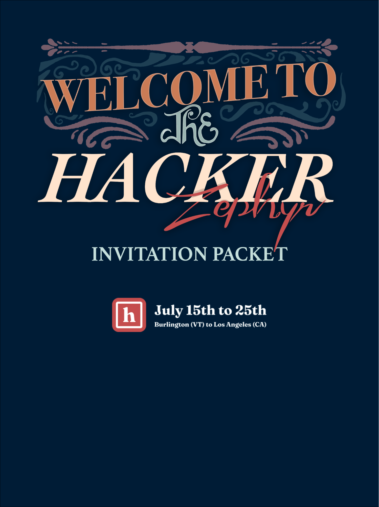

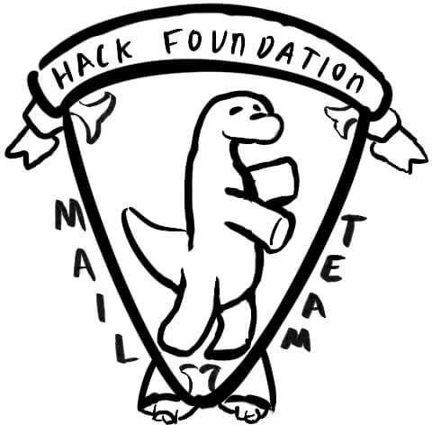

_Greetings to you, the lucky recipient of this invitation!_

I shake you warmly by the hand! Tremendous things are in store for you! Many wonderful surprises await you!

I do invite you to join us on our terrific trans-American trip, which begins at The Hack Foundation headquarters in Burlington (VT), and ends in Los Angeles! You, as one of 42 lucky hackers, will be transported by the latest "loco-motive" technology, provided by The National Railroad Passenger Corporation (Amtrak), through one of the most scenic American train routes. You'll travel 3,502 miles (14% of the globe!) spanning 10 days and 5 major cities all-the-while participating in a "hack-a-thon" from sea to shining sea!

Our journey has 4 major components – a bus ride to NYC, an Amtrak ride to Chicago, a private train ride to Emeryville/San Francisco, and an Amtrak ride to Los Angeles. We expect there to be little to no internet and cell coverage while on the train and our coding festival will have a collaborative focus.

This packet will serve as your primer for what to expect on your journey.

If you have any questions, please don't hesitate to reach out to our team at [zephyr@hackclub.com](mailto:zephyr@hackclub.com).

Max Speed Wofford (@msw)

---

## Content

- [Content](#content)
- [Freqently Asked Questions](#freqently-asked-questions)
- [Itinerary / Map](#itinerary--map)
- [Addresses / Hotels](#addresses--hotels)
- [The Train Team](#the-train-team)
- [What To Bring](#what-to-bring)
- [What Not To Bring](#what-not-to-bring)
- [Emergencies / Safety](#emergencies--safety)
- [The Train Layout](#the-train-layout)
- [Train Tech Specifications](#train-tech-specifications)
- [Expenses & Meals](#expenses--meals)
- [Climate & Weather](#climate--weather)
- [Next Steps](#next-steps)
- [Parent Webinars](#parent-webinars)

---

## Freqently Asked Questions

**Q: What is expected of me now that I'm invited?**

A: Some things for you to keep in mind and expect:

- Please hold off on sharing your invite beyond your immediate family until we announce all invites have gone out!
- Confirm your acceptance within 7 days (NOTE: Parent consent required if under 18)
  - See Parent Webinars section (in table of contents) to help get parent buy-in
- After confirming your acceptance, Tina will reach out to schedule your travel to/from Vermont/California!

**Q: What if I'm asked about my invitation status by another Hack Clubber?**

A: We know it's hard to keep such an exciting secret! But please don't share your invite beyond immediate family... for just a few days! We've sent a public post/email for everyone that will clarify that invitees cannot share details. If they ask, feel free to point to our email asking for people not to ask, because it may put your acceptance in jeopardy.

**Q: What if I'm from outside the United States?**

A: For now, focus on confirming your invite. We'll work with you to try getting you into the United States after you've confirmed you're available from July 15-25th. While booking travel, please bring up if you don't have visa/ESTA access to the United States, or if you don't have vaccinations.

**Q: What if I'm not fully vaccinated?**

A: Your attendance is conditional on vaccination, so you can only come once you're fully vaccinated. If you're in a country where you can get vaccinated now, start booking an appointment. Make sure to confirm your spot ASAP so we can start working on vaccination paperwork with you.

**Q: What does it cost?**

A: The trip is free. That includes flights to Burlington, Vermont before our departure, and flights from Los Angeles, California after we arrive. Additionally, spending money will be provided in each city we stop in, so you'll have the same experience if you don't bring any spending money.

**Q: Should I bring money?**

A: To ensure everyone has a high baseline experience on their trip, spending money will be provided in each city we stop at. We ask you don't bring extra spending money which could change the experience per attendee based on how much they can bring.

**Q: How will I get to Vermont (the start of the trip)?**

A: Most people will take an airplane to Burlington International Airport (BTV). Not every airport has a direct flight to Burlington, so your airline tickets may fly you to a city that does first. If this is the case for you, after waiting a short layover in this connecting airport, your next flight will bring you to us in Burlington. In the event that you're within driving distance of Vermont, we may schedule bus fare for you instead of flight fare.

Once you accept this invite, we will be in touch with more details.

**Q: I can't get to an airport... what should I do?**

A: Please contact us! We want to speak with you personally so that we can work together to figure out a solution. If this is a concern for you, let us know as soon as possible.

**Q: Who can I contact if I have more questions?**

A: Feel free to contact the Zephyr staff at zephyr@hackclub.com or dm us on Slack!

---

## Itinerary / Map

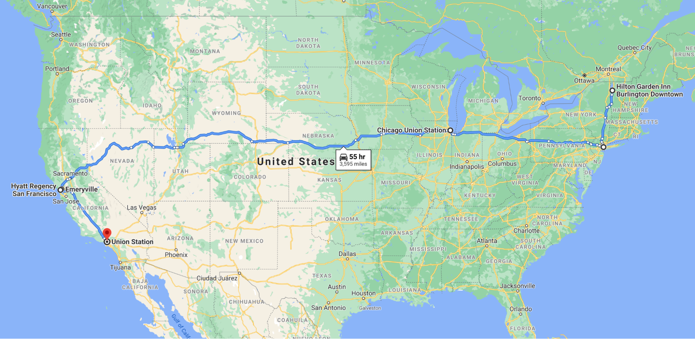

| July 15, Thu | Burlington, VT | Hackers arrive, airport pick upHotel: Burlington Garden Inn, VT                                                                       | _\*Hackers will be 2 to a hotel room, separated by gender with assigned chaperones per floor._                                                                                                                                                                                                              |
| ------------ | -------------- | ------------------------------------------------------------------------------------------------------------------------------------- | ----------------------------------------------------------------------------------------------------------------------------------------------------------------------------------------------------------------------------------------------------------------------------------------------------------- |
| July 16, Fri | Burlington, VT | Lunch at HQ office, afternoon at Kingsland BayDinner campfire at Mt. PhiloHotel: Burlington Garden Inn, VT                            |
| July 17, Sat | Burlington/NYC | Chartered Bus depart Burlington 7:00 am ET, arrive NYC 1:00 pm ETHotel: Doubletree by Hilton Times Square                             | _\*Hackers will be 2 to a hotel room, separated by gender with assigned chaperones per floor._                                                                                                                                                                                                              |
| July 18, Sun | NYC/Chicago    | Amtrak train 49 Lakeshore direct NYC-Chicago depart Penn Station NYC 3:40 pm ET, arrives Chicago Union Square 9:50 am ET the next day | _\*For this leg of the trip, hackers will be seated in Amtrak coach seats for 18 hours. Please make sure to bring neck pillows or items for comfort._                                                                                                                                                       |
| July 19, Mon | Chicago, IL    | Private Cars on the Amtrak train 5 Zephyr departs Chicago at 2:00 pm ET and arrives in Emeryville, CA on July 21 at 4:10 pm PT        | _\*During the day, hackers will be in a 2 level dining car, the Superdome. At night, there will be sleeper cars for all the hackers and they will be separated by gender with assigned chaperones per car. There will be a total of 2 showers available in the sleeper cars for the duration of this trip._ |
| July 20, Tue | (en route)     |
|              |
| July 21, Wed | Emeryville/SF  | Hotel: Hyatt Regency San Francisco                                                                                                    | _\*Hackers will be 2 to a hotel room, separated by gender with assigned chaperones per floor._                                                                                                                                                                                                              |
| July 22, Thu | SF             | Hotel: Hyatt Regency San Francisco                                                                                                    |
| July 23, Fri | SF/Emeryville  | Amtrak train Coast Starlight departs Emeryville at 8:20 am PST and arrives in LA at 9:00 pm PTHotel: Hotel Erwin, Venice Beach        | _\*Hackers will be seated in coach seats for this trip along one of the most scenic coastal routes of America._                                                                                                                                                                                             |
| July 24, Sat | LA             | Space X tour?Hotel: Hotel Erwin, Venice Beach                                                                                         | _\*Hackers will be 2 to a hotel room, separated by gender with assigned chaperones per floor._                                                                                                                                                                                                              |
| July 25, Sun | LA             | Hackers depart LAX                                                                                                                    |
|              |

---

## Addresses / Hotels

| Burlington/ Shelburne, VT    | Burlington Airport                              | 1200 Airport Dr, South Burlington, VT 05403                      |
| ---------------------------- | ----------------------------------------------- | ---------------------------------------------------------------- |
| Hilton Garden Inn Burlington | 101 Main St, Burlington, VT 05401(802) 951-0099 |
| Hack Club Office             | 15 Falls Rd, Shelburne VT 05482                 |
| New York City, NY            | Doubletree Hilton Hotel Times Square, NYC       | 350 W 40th St, New York City, NY 10018-1404(855) 605-0318        |
|                              |
| Penn Station, NYC            | 393 7th Ave. New York, NY 10001                 |
| Chicago, IL                  | Union Station                                   | 225 South Canal Street **Chicago** , Illinois 60606              |
| Emeryville, CA               | Emeryville Train Station                        | 5885 Horton St, Emeryville, CA 94608                             |
| San Francisco, CA            | Hyatt Regency San Francisco                     | 5 Embarcadero Center, San Francisco, CA 94111-4800(415) 788-1234 |
| Los Angeles, CA              | Hotel Erwin, Venice Beach                       | 1697 Pacific Ave, Venice, CA 90291(310) 452-1111                 |
| Los Angeles, CA              | LAX airport                                     | 1 World Way, Los Angeles, CA 90045                               |

---

## The Train Team

| Zach Latta        | Founder/Executive Director, Hack Club zach@hackclub.com |
| Christina Asquith | COO, Hack Club christina@hackclub.com                   |
| Max Wofford       | Engineering/Operations Lead max@hackclub.com            |
| Matthew Stanciu   | Clubs Lead matthew@hackclub.com                         |
| Leo McElroy       | New Clubs Lead leo@hackclub.com                         |
| Zach Fogg         | Community Lead zfogg@hackclub.com                       |
| Woody Keppel      | Hacker Zephyr Tour Conductor                            |
| Rebecca Shapass   | Documentary Filmmaker                                   |

---

## What To Bring

Here's what to bring:

- Yourself, a good attitude, and a smile.
- Your laptop & charger, any other hardware you want for hacking (and don't forget your mobile phone charger too).
- Mask, hand sanitizers and hygiene products like toothbrush, toothpaste, etc. (toilet paper will be provided)
- Any software / media / documents you want to download before the trip (we won't have WiFi for a few parts of the trip)
- Personal health items like prescription medicines, epipens, insulin, inhalers, etc. Make sure that they will last the duration of the 10-day trip.
- Your ID (school ID is acceptable if you don't have a passport/driver's license)
- Light luggage. You'll have to carry it when changing trains & going between hotels, so make sure it's manageable to travel with.
- ~5 outfits / changes of clothes. The train itself will be temperature controlled, but you'll be traveling without a place to wash clothes for up to 4 days, so pack accordingly. Also, bring layered clothing so you can easily adapt to temperature changes.
- Keep a copy of your return flight ticket.

---

## What Not To Bring

Here's what NOT to bring:

- Excess spending money. We'll be providing cash in the cities we stop in. Emergency funds are okay, but shouldn't be used to make regular purchases at our stops. Seethe expenses section for more.
- Illegal items. Duh.
- An attitude that breaks our [Code of Conduct](https://hackclub.com/conduct/).
- Angular.js ;)

---

## Emergencies / Safety

The safety of our Hack Clubbers and staff is top priority at Hack Club and we feel that having our Hack Clubbers and staff fully vaccinated prior to the trip is the best way we can ensure safety against Covid. All of our stopover cities in our itinerary - Burlington, New York, Chicago, San Francisco, LA boast of world class facilities and medical care. We will also have a registered nurse staying with us during our longest train leg, the private charter from Chicago - Emeryville.

Hack Club shall follow CDC/state guidelines on the Amtrak train and city stopovers. Although all participants and staff are fully vaccinated, masks are mandatory for the Amtrak train trips from NYC to Chicago and Emeryville to LA. On our private train ride from Chicago to Emeryville masks will not be required on the train. If a passenger has medical conditions, please inform us immediately and make sure that all medications are packed for the duration of the trip. Kindly ensure that the contact information you provide us is up to date in case we need to contact you.

> **For life threatening emergencies, please dial 911. In such cases, Amtrak will stop their train for an ambulance to pick up the patient.**

> **To contact a team member on the train regarding non-life threatening emergencies, please call/text**  **Max Wofford**  **or**  **Zach Fogg****. Keep in mind the train will be out of cell coverage for some sections of the trip.**

> **To contact a team member at our office, please call**** Tina Soriano ****.**

**Rules on Amtrak and the Private Train**

On our private charter from Chicago-Emeryville, we will have more freedom of movement and activities. However, on the public Amtrak charters from NYC - Chicago and Emeryville - Los Angeles, please bear in mind that we are sharing space with others. Be mindful of your noise levels and be careful of your personal belongings. You will also be required to wear a mask on the Amtrak segments of the trip, unless CDC guidelines change by then. One major rule of train travel is **do not wander off during stopovers**. The train will not wait for you. Amtrak conductors pride themselves in leaving on the dot.

**Travel Safely in Cities**

Few things to keep in mind, especially when travelling in sprawling cities like New York:

- Stick to your group in the train station. Do not wander off or leave your belongings unattended.
- Do not get into an unmarked taxicab, do not share transportation with strangers and always be wary of pickpockets.
- Beware of con muggers who dress as police officers and other forms of scams.
- Avoid money changers in public areas and if you need to use an ATM, use one during the day with lots of bystanders.
- Keep your hotel key/card secured. If it is numbered and it ends up lost, thieves are able to rob your hotel room.
- Have a buddy system, check up on your buddy by the end of each day.
- Although we will have a first aid kit with the team, you can pack some items like Ibuprofen and bandAids to anticipate any headaches or blisters.

---

## The Train Layout

**1. Amtrak Lakeshore coach seats from NYC - Chicago**

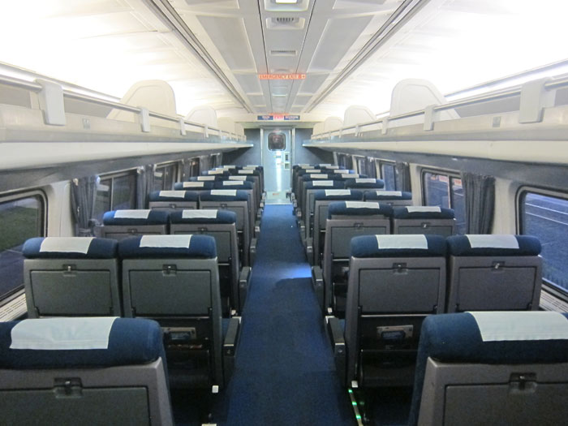

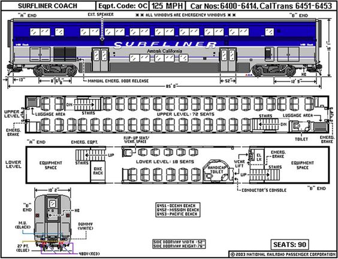

**2. Private SuperDome from Chicago - Emeryville**

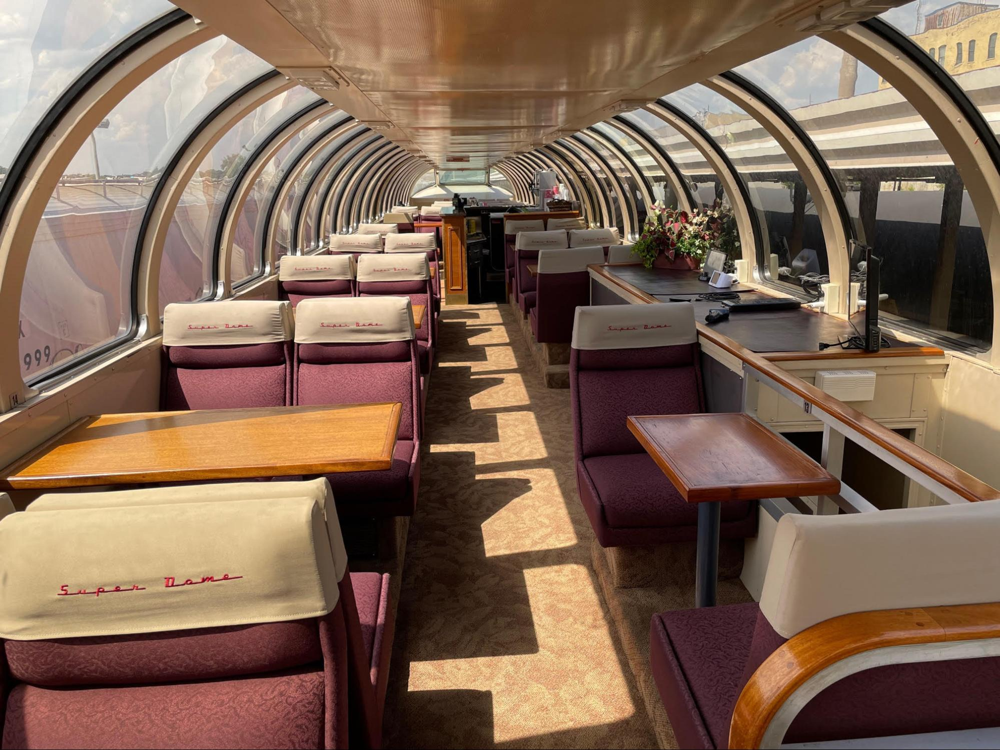

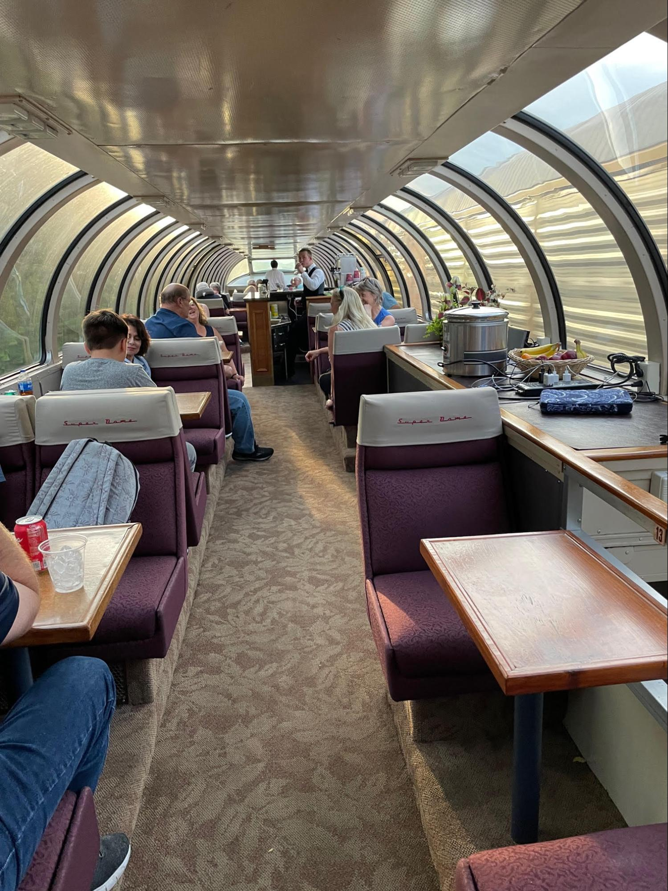

**3. Sleeper Cars from Chicago to Emeryville**

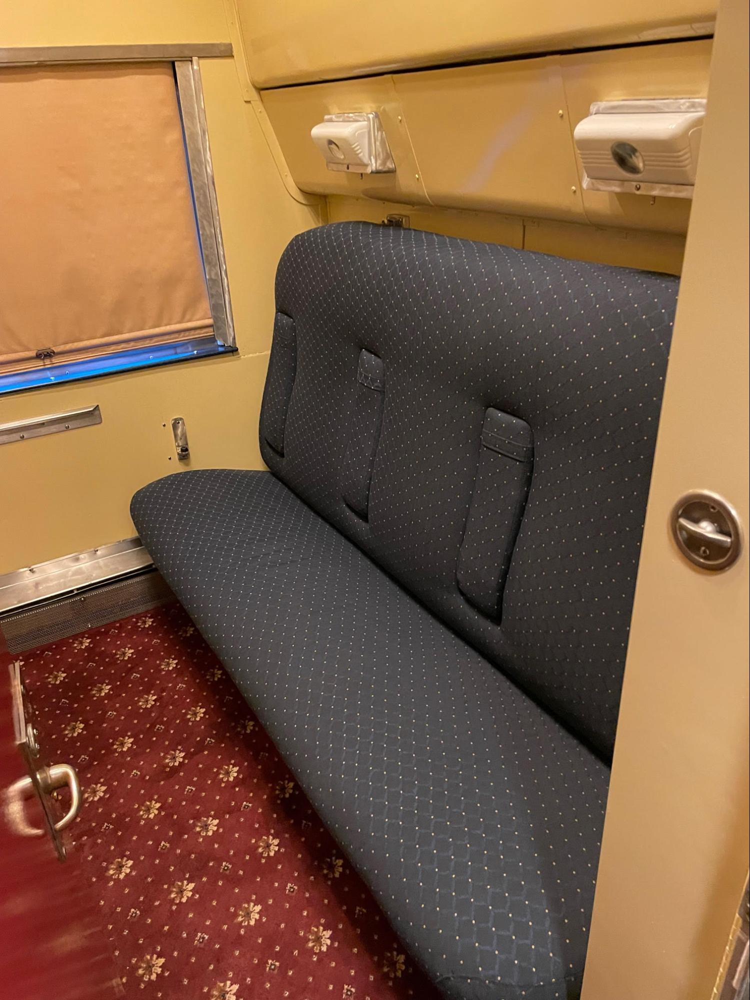

**4. Amtrak Roomettes (For staff on NYC - Chicago and Chicago - Emeryville)**

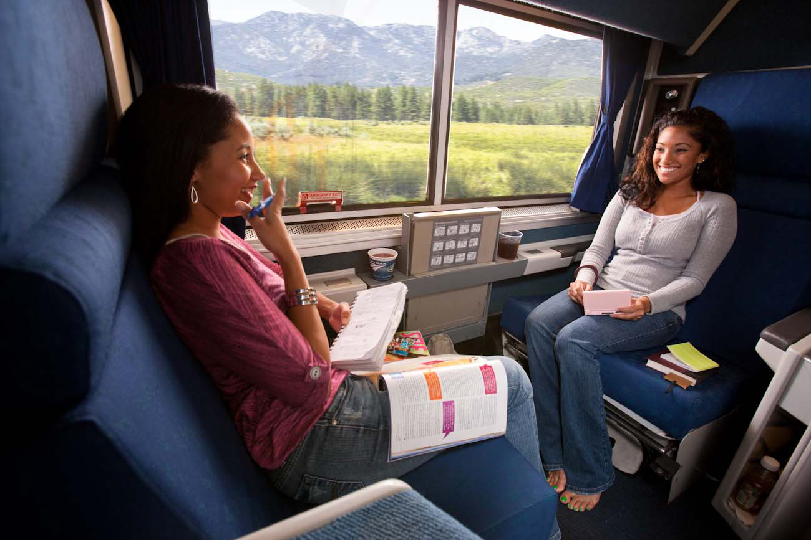

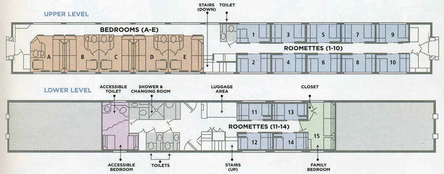

**5. Amtrak Coast Starlight coach seats from Emeryville - Los Angeles**

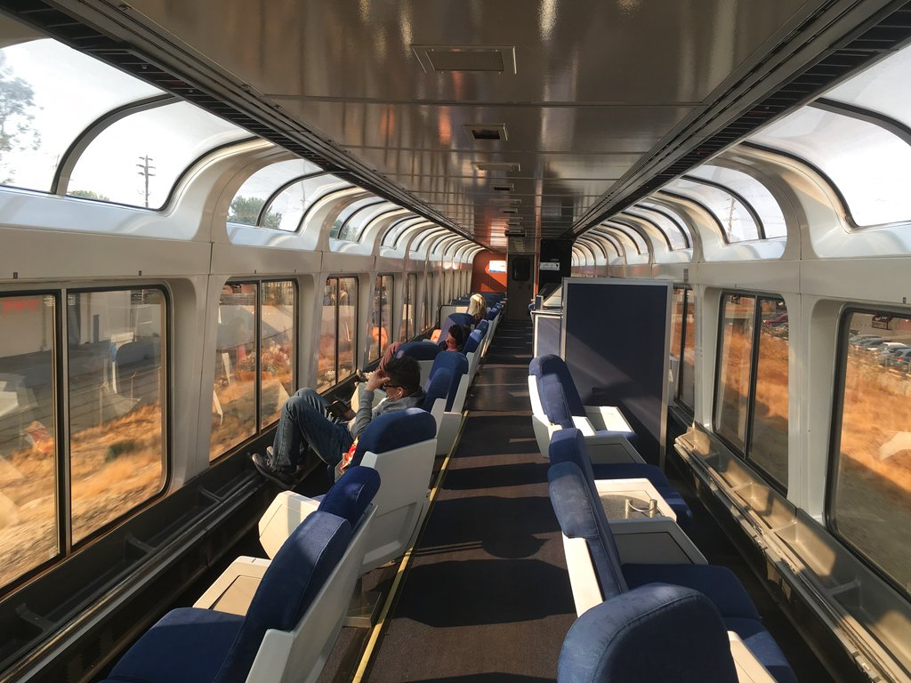

---

## Train Tech Specifications

For the duration of the train trip and hackathon, there will be no internet connectivity. On certain parts of the trip there will be no cell towers, this means there will be sections of the trip in which parents are unable to contact or hear from their child. We are encouraging our Hack Clubbers to socialize, collaborate and enjoy the scenic trip on this magical journey. To reiterate those dates and times that we may be off the grid, kindly refer to the table below. As soon as we reach our city stopover, parents and children should be able to make contact.

| July 18, Sun 3:40 pm ET - July 19, Mon 9:50 am ET                                                                                  | NYC - ChicagoAmtrak train 49 Lakeshore direct NYC-Chicago depart Penn Station NYC 3:40 pm ET, arrives Chicago Union Square 9:50 am ET the next day |
| ---------------------------------------------------------------------------------------------------------------------------------- | -------------------------------------------------------------------------------------------------------------------------------------------------- |
| July 19, Mon 2:00 pm ET -July 21, Wed 4:10 pm ET                                                                                   | Chicago - EmeryvillePrivate Cars on the Amtrak train 5 Zephyr departs Chicago at 2:00 pm ET and arrives in Emeryville, CA on July 21 at 4:10 pm PT |
| _\*This will be the longest leg of the trip, so kindly make sure you check in with your parents/child before July 19, 1:00 pm ET._ |
| July 23, Fri 8:20 am - 9:00 pm PT                                                                                                  | Emeryville - LAAmtrak train Coast Starlight departs Emeryville at 8:20 am PT and arrives in LA at 9:00 pm                                          |

During the Hacker Zephyr hackathon, Hack Club will ensure that you have power on the trains so that you can hack on your project. Extension cables and power strips will be provided throughout the journey. If you are coming from a different country, please make sure you have a power adapter for the United States.

---

## Expenses & Meals

Hackers will be given a stipend for each city we stop in. They're free to spend it however they'd like– we won't be authorizing purchases. The intent is to provide a high base-line experience for all participants. Please don't bring extra spending money for our stops– we'd like to prevent participant experiences being too different. Emergency funds are okay.

Meals on trains are as follows:

| July 18, Sun - July 19, Mon | NYC/Chicago   | Amtrak train 49 Lakeshore                 | Hack Club staff will purchase meals for the students, which will be served in their coach seats. |
| --------------------------- | ------------- | ----------------------------------------- | ------------------------------------------------------------------------------------------------ |
| July 19, Mon - July 21, Wed | Chicago, IL   | Private Cars on the Amtrak train 5 Zephyr | Breakfast, lunch, dinner and snacks will be provided on the SuperDome.                           |
| July 23, Fri                | SF/Emeryville | Amtrak train Coast Starlight              | Hack Club staff will purchase meals for the students, which will be served in their coach seats. |

Please note that all meals will be the same for all students due to logistic limitations. If you have dietary restrictions, kindly communicate your preferences to us upon confirmation of your invitation and we will do our best to accommodate them. Otherwise, train meals will be set menus.

---

## Climate & Weather

We'll be travelling across the United States in the middle of Summer. Make sure to bring clothes for warm weather. We'll generally be inside, but having something waterproof in case of rain in one of our layover cities is nice to have.

We recommend having a light outfit for general use and a heavier outer covering just in case.

---

## Next Steps

Thank you once again for joining us on this magical adventure. Here are the next steps that each invitee and their parents need to take to confirm their spot and travel arrangements.

1. You will receive an emailed docusign from us to confirm your invitation. Sign it ASAP to confirm your invitation, or email us to turn down your invitation. After 7 days your invitation will be turned down.
2. We'll reach out to book your travel to Vermont / from Los Angeles. After receiving your travel preferences, we will email your flight itinerary & tickets to you.
3. We'll send you a Supervision Waiver which will let you opt-in to spending unsupervised time in each of our stops (Burlington (VT), New York City, San Francisco, & Los Angeles). Hack Clubbers without their waiver will have to spend city time in groups with staff. Further details will be provided when the waiver is sent.
4. Please remember to check in your flight 24hrs prior to departure and we will arrange for airport pickup in Burlington. We are a small team but Burlington is a manageable airport and we will try to group the flight arrivals as best we can.
5. Invitation acceptance deadline is seven days down to the hour from the day you received your invite, and you're expected to have a quick response time with us whilst booking your travel. We will need to confirm our passenger and guest lists with the trains and hotels 2 weeks prior to the trip.
6. Please understand that once you commit to the trip, there are huge costs incurred and any withdrawals must be communicated ASAP so we can give another Hack Clubber this great opportunity.
7. The trip begins on July 15, Thursday and ends on July 25th, Sunday. For further questions, concerns, requests, please feel free to reach out to Tina, she will be the main point of contact for our parents and hackers.

Dedicated point of contact in Vermont for parents and Hack Clubbers:

|  | Tina Soriano | Assistanttina@hackclub.com
 |     |
 | --- |  |  |

Secondary point of contact in Vermont in case of emergencies:

|  | Melanie Smith | Bank Operations Leadmelanie@hackclub.com

 |     |
 | --- |  |  |

---

## Parent Webinars

We set aside some time to speak with your parents via Zoom. There will be several half-hour sessions where your parents can ask Zach Latta and Christina Asquith (CEO and COO of Hack Club) anything at all. This is not mandatory but it is encouraged, especially if your parents have any reservations about this trip.

Parent webinars can be joined at the following times/links:

- 2:30 PM Pacific / 5:30 PM Eastern, Friday, 6/18 [redacted link]
- 7 AM Pacific / 10 AM Eastern, Monday, 6/21 [redacted link]
- 6 PM Pacific / 9 PM Eastern, Wednesday, 6/23 [redacted link]
