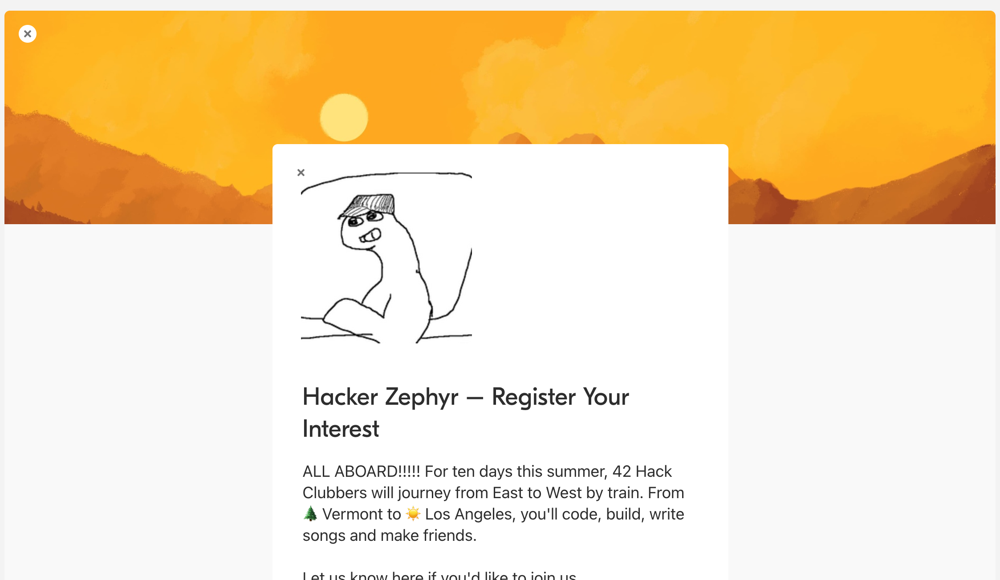

_This is an export of the Airtable form used for registering interest. Below is a screenshot._

# Hacker Zephyr – Register Your Interest

ALL ABOARD!!!!! For ten days this summer, 42 Hack Clubbers will journey from East to West by train. From 🌲Vermont to ☀️Los Angeles, you'll code, build, write songs and make friends. 

Let us know here if you'd like to join us. 

This form is a pre-registration form; it only indicates strong interest, and is not a commitment to go on the trip. After you fill this out, you'll receive more information in a few days.

As much as we'd like to include every Hack Clubber on this trip, restrictions from the rail switching station in Denver limits the number of train cars we can chain together. Only 42 Hack Clubbers can fit.

We want to bring the 42 Hack Clubbers who this trip will personally impact the most. Think of it as a "soul-need based" invitation process. It is likely that some active community members who want to go won't be able to because of this. The invitation process has everything to do with how much this trip will personally impact each attendee. We wish you all could come.

For any questions, shoot an email to zephyr@hackclub.com. 💖🚃💻💨

— Orpheus, your conductor

---

### Your Full Name *

### Your Email Address *

> We'll only use this to send you important communications leading up to the trip. We'll never spam you.

### Your Phone Number *

> We'll only use this during the trip to contact you in case we need to get ahold of you quickly. We will never call or text you before or after the trip.

### Parent's Name *

### Parent's Email Address * 

> We'll use this to send your parent important information, such as waivers, full schedule, etc. when those are ready. We won't use it for anything else.

### Parent's Phone Number *

> We'll only use this during the trip to contact your parents in case of an emergency. We expect that we'll never have to use this number.

### Your Birthday * 

### What do you hope to get out of The Hacker Zephyr? * 

> Don't be intimidated by this question or feel like you have to pad it up/make yourself "look good"/etc. This question is one of many things we'll use to determine eligibility. Just be yourself & be totally honest.

### Are you free for the duration of the trip? * 

> The trip starts on July 15th and ends on July 25th. You'll need to be free for the duration of the trip.

-   Yes
    
-   No
    
-   I have a conflict, but will try to move it.
    
### What is the nearest airport to you? *

> I'm a nerd, so please give it to me as a IATA airport code. Non-nerds: find your airport by filling out the "Search Location Codes" section at the bottom of this page: [https://www.iata.org/en/publications/directories/code-search/](https://www.iata.org/en/publications/directories/code-search/)

### Will you be fully vaccinated by July 15th? *

> You will have to provide proof of vaccination in order to be able to board the Hacker Zephyr.

-   Already fully vaccinated
    
-   Not yet fully vaccinated, but I will be by July 15th
    
-   Will not be vaccinated by July 15th

### Dietary restrictions

> Wouldn’t want your dining experience to turn sour. Please be as specific as possible. We'll do our best to accommodate your needs.

### What do you see when you look at this image? *

> [https://hack.af/rorschach](https://hack.af/rorschach) — Don't overthink this. This won't be used to determine your eligibility. What's the first thing(s) that comes to mind?

### Application Record ID *

> Now now, don't touch this. Please I beg you. It performs some sort of dark magic only my boss can understand.
